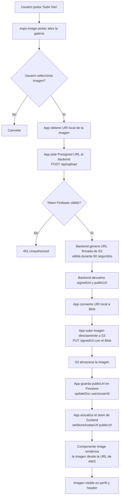

# Flujo de subida de imágenes a AWS S3

## Diagrama de flujo 



## Descripción de cada paso

**1. Selección de imagen**  
El usuario pulsa el avatar en la pantalla de perfil. `expo-image-picker` solicita permisos de galería al sistema operativo y muestra el selector de imágenes nativo.
 
**2. Obtención de Presigned URL**  
La app envía una petición `POST /api/upload` al backend con el nombre del archivo y el tipo de contenido. El backend verifica el token de Firebase y g
enera una URL firmada criptográficamente por AWS, válida durante 60 segundos. Esta URL permite subir un archivo directamente a S3 sin exponer las credenciales de AWS.
 
**3. Subida directa a S3**  
La app convierte la URI local de la imagen a un Blob y lo sube directamente a S3 usando la URL firmada con el método `PUT`. El archivo nunca pasa por el backend — va directo del dispositivo a S3. Esto reduce la carga del servidor y mejora el rendimiento.
 
**4. Persistencia de la URL**  
Una vez subida la imagen, S3 genera una URL pública permanente. La app guarda esta URL en Firestore en el documento del usuario (`users/{userId}.avatarUrl`).
 
**5. Actualización del estado**  
La app actualiza el store de Zustand con la nueva URL, lo que provoca que todos los componentes que leen `avatarUrl` (perfil y header) se rerenderizen automáticamente mostrando la nueva imagen.
 
**6. Renderizado**  
El componente `Image` de React Native carga la imagen desde la URL de AWS S3:
 
```tsx
<Image 
    source={{ uri: avatarUrl }} 
    style={{ width: 96, height: 96, borderRadius: 999 }} 
/>
```

## Por qué Presigned URLs y no subida directa desde el backend
 
Subir la imagen al backend y luego al S3 tendría dos problemas:
- **Rendimiento** — la imagen viaja dos veces por la red (móvil → backend → S3)
- **Límites de Vercel** — las funciones serverless tienen un límite de tamaño de payload
Con Presigned URLs la imagen va directamente del dispositivo a S3, y el backend solo genera la URL firmada (operación ligera).