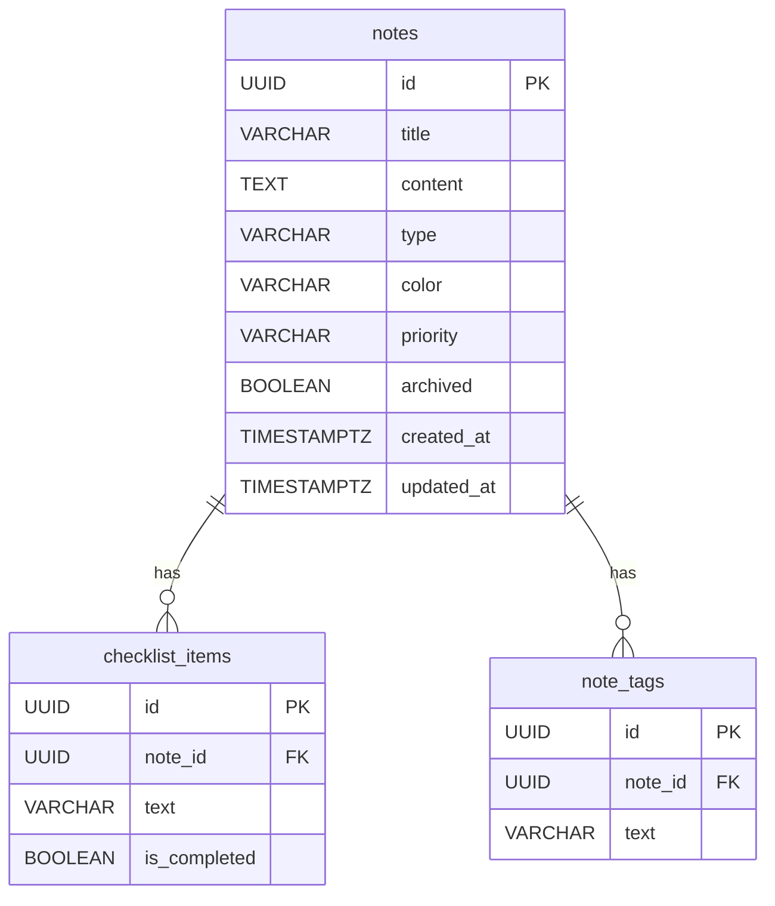

## Patrón cliente-servidor
Una app móvil nunca debe conectarse directamente a una base de datos. Si el connection string de PostgreSQL estuviese embebido en el binario de la app, cualquiera que la descompile tendría acceso completo a todos los datos.
El patrón cliente-servidor separa las responsabilidades en tres capas:

 - Cliente — la app móvil (React Native/Expo). Solo muestra datos y envía peticiones.
 - Servidor — la API REST (Next.js). Valida los datos, aplica las reglas de negocio y decide qué operaciones están permitidas.
 - Base de datos — PostgreSQL (Neon). Solo el servidor tiene acceso directo.

La API actúa como guardián: ningún cliente puede leer ni modificar datos sin pasar por ella.

## API REST
REST (Representational State Transfer) es un estilo de arquitectura para diseñar APIs. Una API REST expone recursos (notas, checklists, ideas) a través de URLs, y el cliente interactúa con ellos usando métodos HTTP estándar.
Principios clave:

Cada recurso tiene una URL única: `/api/notes/[id]`
Las operaciones se expresan con métodos HTTP, no con verbos en la URL
Las respuestas son stateless: cada petición contiene toda la información necesaria

## Métodos HTTP

### GET - Leer datos
Ejemplo en noteflow:
GET /api/notes — obtiene todas las notas

### POST - Crear datos
Ejemplo en noteflow:
POST /api/checklists — crea una checklist nueva

### PATCH - Modificar parcialmente
Ejemplo en noteflow:
PATCH /api/notes/[id] — actualiza el título de una nota

### DELETE - Eliminar
Ejemplo en noteflow:
DELETE /api/ideas/[id] — elimina una idea

## Códigos de estado
| Código | Significado | Cuándo se usa |
|--------|-------------|---------------|
| 200 OK | Éxito | GET y PATCH exitosos |
| 201 Created | Creado | POST exitoso |
| 204 No Content| Sin contenido | DELETE exitoso |
| 400 Bad Request | Datos inválidos | Validación con Zod fallida |
| 404 Not Found | No encontrado | El recurso no existe |
| 500 Internal Server Error |Error del servidor |Error inesperado en la API |

Nunca se devuelve el error real de la base de datos al cliente — es información interna que un atacante podría aprovechar.

## Diagrama entidad-relación


 - notes → checklist_items: una nota puede tener muchos items (1:N)
 - notes → note_tags: una nota puede tener muchos tags (1:N)

## Diferencia INNER JOIN y LEFT JOIN
**INNER JOIN** devuelve solo las filas que tienen coincidencia en ambas tablas. Si una nota no tiene tags, no aparece en el resultado.

**LEFT JOIN** devuelve todas las filas de la tabla izquierda y las coincidentes de la derecha. Si no hay coincidencia, devuelve NULL en las columnas de la tabla derecha.

En NoteFlow se usa LEFT JOIN porque una nota puede no tener items o tags — con INNER JOIN esas notas desaparecerían del resultado:
```sql
-- Con LEFT JOIN, las notas sin items también aparecen (items = null)
SELECT n.*, json_agg(ci.*) FILTER (WHERE ci.id IS NOT NULL) as items
FROM notes n
LEFT JOIN checklist_items ci ON n.id = ci.note_id
GROUP BY n.id;

-- Con INNER JOIN, las notas sin items NO aparecerían
SELECT n.*, json_agg(ci.*) as items
FROM notes n
INNER JOIN checklist_items ci ON n.id = ci.note_id
GROUP BY n.id;
```